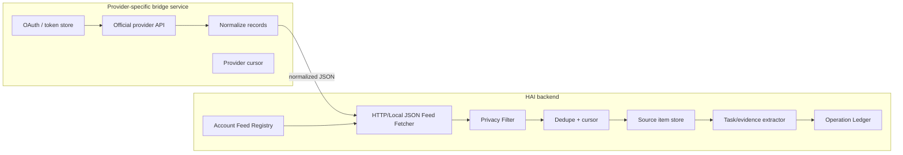

# Account Feed Bridges (HAI Phase 2, §14/§10.11)

HAI ingests account items through read-only bridges. The generic JSON feed is the
production boundary; provider bridges (Gmail, GitHub, Trello, Drive, Calendar,
…) are honest contracts — HAI never fakes OAuth or a connected status.

**Implementation:** `backend/internal/accountfeed` (bridge contracts, permission
registry, generic-feed format + validation, local/HTTP fetcher, feed registry
with sync + audit, handler). API under `/api/v1/account-feeds`.

## Bridge architecture (§14)

The **provider-side** box (OAuth, official API, record mapper) is external and is
NOT implemented in this phase — HAI only implements the right-hand HAI-backend
box plus honest bridge contracts describing what the provider side must provide.

## Connector preference (§14)

1. Official API connector
2. Local export / normalized feed
3. Browser-assisted read-only capture
4. Guarded browser automation
5. Human / manual fallback

## Provider bridges + truthful status

| Provider | Kind | Status without credentials |
| --- | --- | --- |
| `generic_json_feed` | local production path | `available` |
| `local_folder` | local | `available` |
| `gmail`, `google_drive`, `google_calendar`, `github`, `trello` | official-API contract (read-only) | `credentials_required` (→ `credentials_present_unverified` with a token; **never `connected`** without a real read) |
| `upwork_assisted`, `chat_export`, `browser_capture` | assisted / manual / browser contract | `contract_only` |

- All bridges are **read-only**; the permission registry allows no writes.
- `credentials_present_unverified` means a credential exists but no real read has
  proven a live connection — HAI does not claim `connected` from configuration.
- HTTP JSON feeds are disabled by default and reject link-local/metadata hosts.
- Generic-feed items are validated (§10.11): `externalId`/`provider`/`itemType`
  required, `title|content` required, size bounds, and `sourceUri` must not
  contain secrets.

Proven by `scripts/smoke-account-bridges.sh` (16/16).
