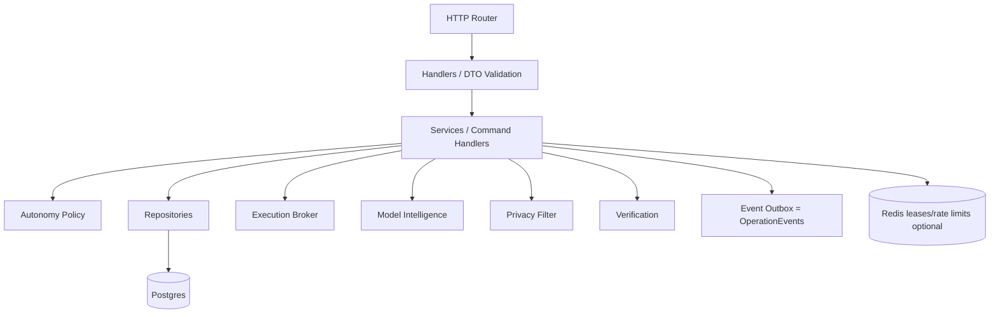
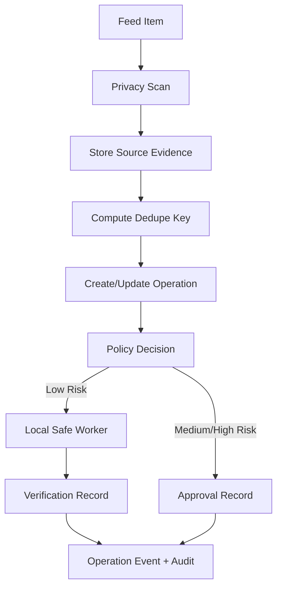
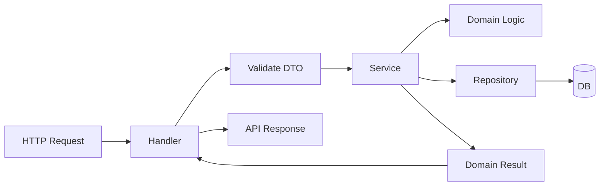
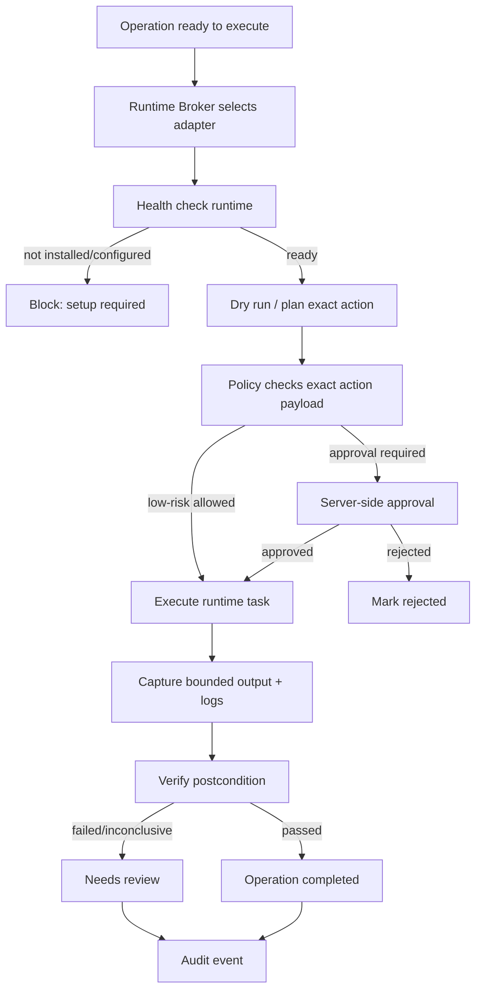
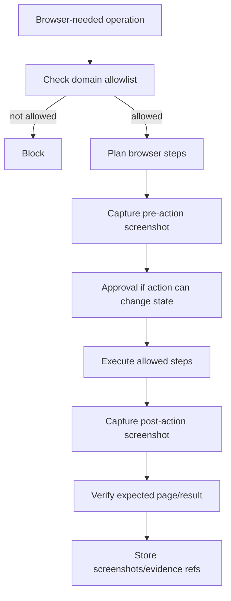
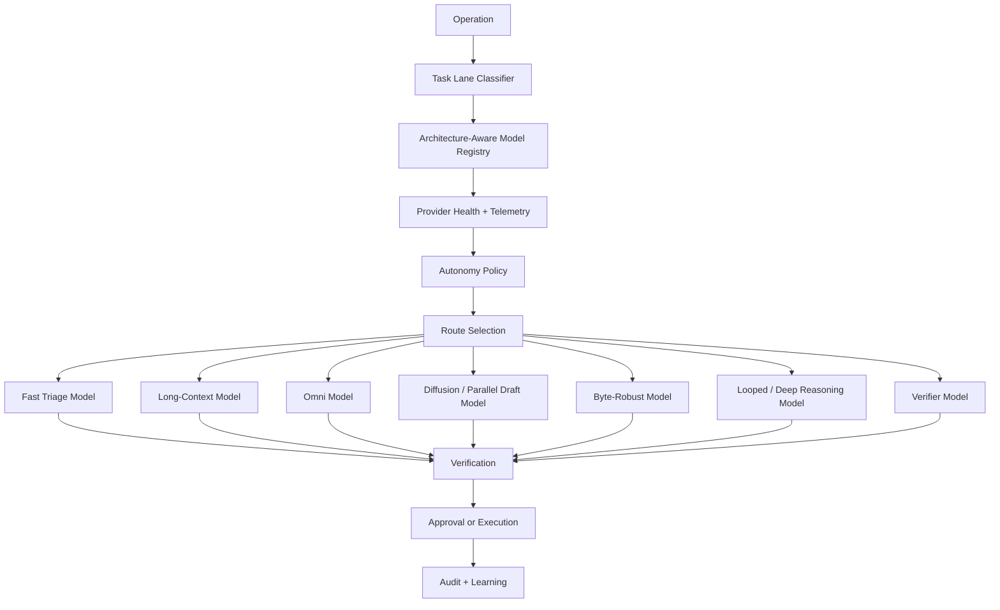
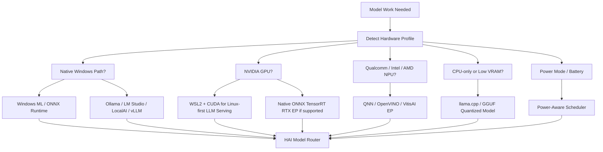
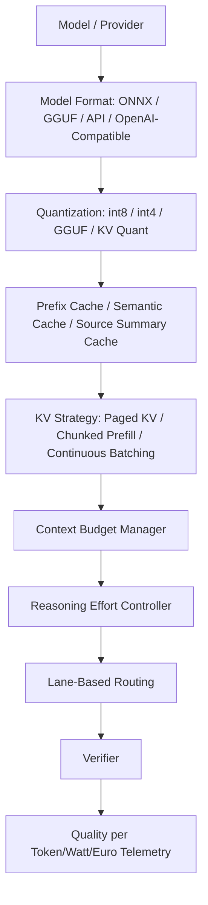

# HAI Phase 2 — Backend Architecture (§11/§15/§16/§18)

This document preserves the mandatory Phase 2 backend flowcharts and maps each to
the packages that implement it. Everything here is real, tested code on branch
`codex/hai-next`; nothing is faked.

## Package architecture

| Concern | Package |
| --- | --- |
| Operation Ledger | `internal/operations` |
| Background autonomy loop | `internal/background` |
| Autonomy policy engine | `internal/autonomypolicy` |
| Privacy / PII filter | `internal/privacyfilter` |
| Execution broker + local safe worker | `internal/executionbroker` |
| Runtime Lab (Hermes/Odysseus/contracts; read-only canonical OpenClaw projection) | `internal/runtimelab` |
| Governed agent-runtime registry and approved execution | `internal/agentruntime` |
| Architecture-aware model intelligence | `internal/modelintelligence` |
| Windows/local hardware profile | `internal/hardwareprofile` |
| Account feed bridges + registry | `internal/accountfeed` |
| Always-on runtime control (emergency stop/recovery/readiness) | `internal/opscontrol` |
| Idempotency + canonical JSON hashing | `internal/idempotency` |
| Composition root + HTTP handlers | `internal/phase2` |

## Ingestion → operation pipeline

Implemented by `accountfeed.Registry.Sync` (fetch → privacy scan → dedupe-ingest)
and `background.Worker` (decision → safe worker + verify / approval).

## Repository / service / handler separation

## Runtime broker (§15)

In Phase 2 the only adapter that actually executes is the local safe worker
(`executionbroker`); Hermes/OpenClaw/Odysseus are honest contracts that refuse
execution until real, operator-verified (`runtimelab`).

## Browser automation boundary (§15)

The browser runtime is a **contract only** (`runtimelab` `newBrowserContract`):
allowed read/draft actions and forbidden-by-default state changes are published;
no executor is wired or faked.

## Architecture-aware routing (§16)

Implemented by `modelintelligence` (`ClassifyLanes`, `Router.Route`, registry,
telemetry). The privacy lane restricts cloud routing; the fast-triage lane runs a
real bounded local call per background operation.

## Windows serving-stack selection (§18)

Implemented by `hardwareprofile` (`Detect`, `SelectServingStack`, power policy).
Detection is truthful: Windows ML / GPU / NPU are never claimed off-Windows or
without detection; unknown hardware selects `onnx_runtime_cpu`.

## Efficiency optimization pipeline (§18)

Implemented by `modelintelligence` (`OperationBudget`, `Cache` with §19 reuse
boundaries, `RecommendReasoning`, `Router`, `ComputeQualityScore`, durable
`TelemetryStore`). Model format/quantization/KV labels are metadata HAI records;
it does not implement foundation-model internals.

## Model telemetry transaction (§10.9)

Model calls happen outside the DB transaction. After a call, HAI creates a
durable `ModelRunTelemetry` row (`models.ModelRunTelemetry`, persisted via
`modelintelligence.GormTelemetryRepository`), updates observed metrics + claim
level, writes a cache record if safe, and appends an OperationEvent if linked.
Telemetry survives restart (proven in `smoke-model-intelligence.sh`).

## Outbox

`OperationEvent` rows are the durable event log written alongside every state
change. The Kafka publisher is optional and disabled in this deployment, so no
events are lost (they persist in Postgres). No fake publisher is implemented.
