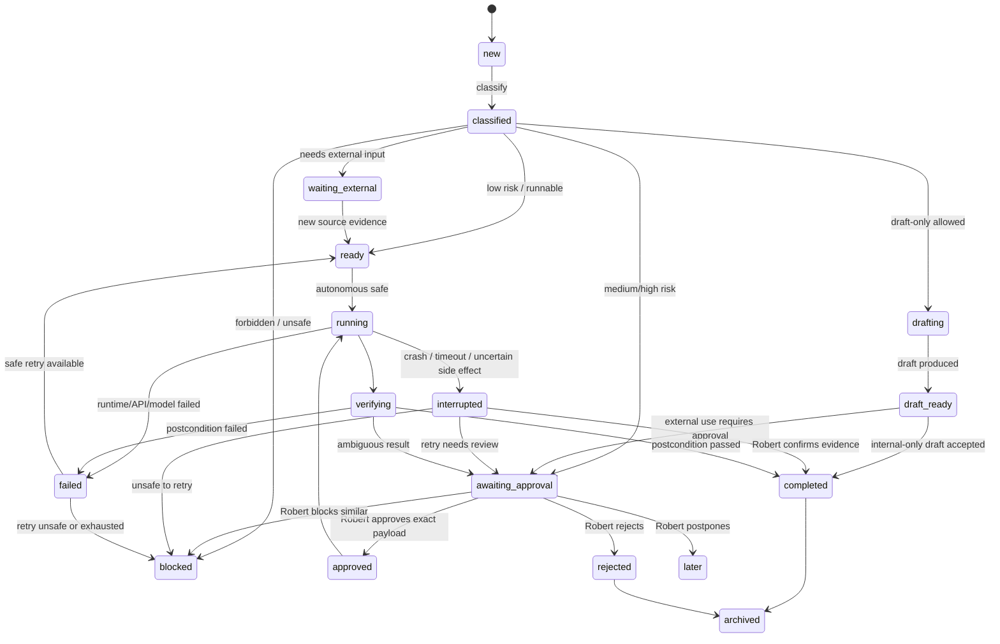

# Operation Ledger (HAI Phase 2, §7/§8/§10.5)

The Operation Ledger is the root aggregate of the autonomous back-office control
plane. Every source item, decision, approval, execution, verification, and audit
event links to an Operation.

**Implementation:** `backend/internal/operations` (enums, domain, state machine,
GORM model `models.Operation` + `models.OperationEvent`, Gorm + in-memory
repositories, service). Persisted in Postgres via `AutoMigrate`.

## State machine (§8)

## How the implementation maps to the diagram

| Transition | Where |
| --- | --- |
| `new → classified` | `background.Worker.processOne` after privacy scan + policy decision |
| `classified → ready → running → verifying → completed` | `background.ExecuteSafeOperation` (safe local worker path) |
| `classified → awaiting_approval` | policy decision `ask_robert` / high risk |
| `classified → blocked` | policy `block`, or an operator **block-similar** rule |
| `awaiting_approval → approved` | `POST /operations/:id/approve` |
| `awaiting_approval → rejected (dismissed)` | `POST /operations/:id/reject` |
| `awaiting_approval → later` (self-hold) | `POST /operations/:id/later` (sets `nextReviewAt`) |
| `awaiting_approval → blocked` (+ rule) | `POST /operations/:id/block-similar` |
| `running → interrupted`, `verifying → awaiting_approval` | crash/reboot recovery (`opscontrol.Recover`) |

## Invariants (enforced in code)

- No Operation reaches `completed` unless `verificationStatus` is `passed` or
  `not_required` (`operations.ApplyTransition`). Verified by tests + smoke.
- Every transition writes an immutable `OperationEvent` (audit timeline).
- Dedupe + canonical-JSON hashing (`internal/idempotency`) prevent duplicate
  Operations across repeated feed syncs.
